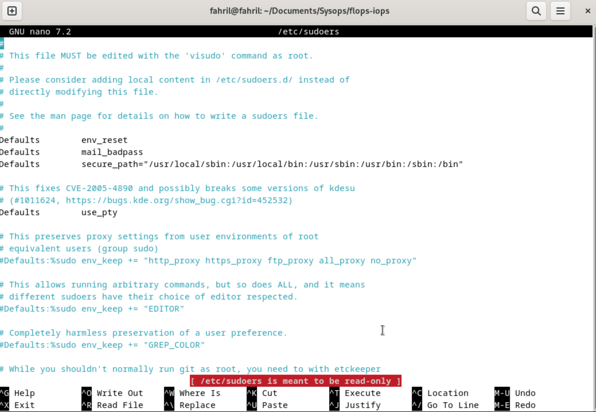
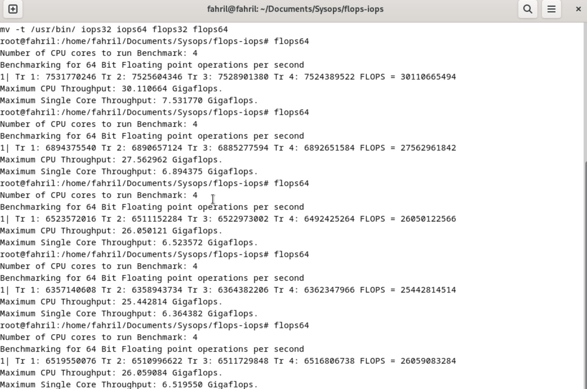

  <h1 style="text-align: center;font-weight: bold">Praktikum 3 SysOp</h1>
  <h4 style="text-align: center;">Dosen Pengampu : Dr. Ferry Astika Saputra, S.T., M.Sc.</h4>

 

  
  <h3 style="text-align: center;">Disusun Oleh : </h3>
  

    <strong>Mochammad Fahril Rizal (3123500013)</strong> 
    <strong>Adrian Yoga Chrisarianto (3123500021)</strong> 
    <strong>Muhammad Arief Wicaksono Putra Santoso (3122500022)</strong>
  

<h3 style="text-align: center;line-height: 1.5">Politeknik Elektronika Negeri Surabaya Departemen Teknik Informatika Dan Komputer Program Studi Teknik Informatika 2023/2024</h3>
  

## Daftar Isi
1. [Pendahuluan](#about-cpu)
2. [Soal](#soal)
    - [Soal 1](#1-buatlah-presentasi-langkah-demi-langkah-tentang-siklus-cpu-fetchdecodeexecute-utk-mengeksekusi-sebuah-program-jelaskan-juga-peran-dari-bahasa-pemrograman-dan-compiler-begitu-juga-dengan-peran-dari-sistem-operasi-gunakan-referensi--video-referensi-1-dan-video-referensi-2)
    - [Soal 2](#2-apabila-debian-vm-mu-masih-belum-terdapat-packeage-gcc-make-dan-git-lakukan-instalasi-dan-catat-setiap-langkahnya)
    - [Soal 3](#3-jalankan-vm-debian-anda-lalu-lakukan-clone-httpsgithubcomferryastikaflops-iops-compile-dan-eksekusi-sesuai-petunjuk-sesuiakan-jumlah-thread-dengan-jumlah-cpu-yang-ada-di-vm-debianmu-catat-hasilnya-dan-jelaskan-arti-dari-hasil-ekskusi-lakukan-sebanyak-5-kali-bandingkan-hasilnya-anatar-temanmu-buat-plot-perbandinnga-hasil-untuk-masing-masing-pc-di-tiap-kelompokmu-analisa-hasil-percobaan-tadi-dan-beri-kesimpulan-tentang-iops-dan-flops)
3. [Analisa](#analisa-hasil-tes-brenchmark)
4. [Kesimpulan](#kesimpulan)
5. [Referensi](#referensi)

# About CPU
CPU (Control Processing Unit) adalah komponen utama yang bertanggung jawab atas tugas pemrosesan data dan menjalankan instruksi-instruksi program. CPU tersedia dalam berbagai model dan. masing-masing memerlukan slot tertentu pada Motherboard. 

Sebuah CPU dapat memiliki satu atau beberapa core. CPU dengan satu core hanya dapat menjalankan satu tugas pada satu waktu, sedangkan CPU dengan multicore dapat menjalankan beberapa tugas secara bersamaan.

# SOAL
### 1. Buatlah presentasi langkah demi langkah tentang siklus CPU (fetch,decode,execute) utk mengeksekusi sebuah program. Jelaskan juga peran dari Bahasa pemrograman dan compiler, begitu juga dengan peran dari Sistem Operasi. Gunakan referensi : Video referensi 1 dan Video referensi 2
**Jawab:**
## Link PPT
https://www.canva.com/design/DAF_XVqVaGA/9oEkVnNyncrgFKXQTYBwdg/view?utm_content=DAF_XVqVaGA&utm_campaign=designshare&utm_medium=link&utm_source=editor

### 2. Apabila Debian VM mu masih belum terdapat package gcc, make dan git, lakukan instalasi dan catat setiap langkahnya!
**Jawab:**
## Installation package gcc, make dan git
1. Masuk ke terminal debian

2. Pindah User ke Administrator dengan perintah su root

3. Install gcc, make dan git 

3. Masuk ke admin dengan perintah nano /etc/sudoers

4. Klik ctrl+c lalu ctrl+x

### 3. Jalankan VM Debian anda, lalu lakukan clone https://github.com/ferryastika/flops-iops. Compile dan eksekusi sesuai petunjuk. Sesuiakan jumlah thread dengan jumlah CPU yang ada di VM Debianmu. Catat hasilnya dan jelaskan arti dari hasil ekskusi. Lakukan sebanyak 5 kali. Bandingkan hasilnya anatar temanmu. Buat Plot perbandinnga hasil untuk masing-masing PC di tiap kelompokmu. Analisa hasil percobaan tadi dan beri kesimpulan tentang IOPS dan FLOPS.
**Jawab:**
## FLOPS dan IOPS

FLOPS (Floating Point Operations Per Second) adalah ukuran kinerja dalam komputasi yang mengukur jumlah operasi titik mengambang yang dapat dilakukan oleh sebuah prosesor dalam satu detik. FLOPS sering digunakan untuk mengukur kecepatan prosesor dalam melakukan perhitungan numerik, seperti yang sering terjadi dalam pemrosesan data ilmiah dan aplikasi kecerdasan buatan yang memerlukan komputasi intensif.

IOPS (Input/Output Operations Per Second) adalah ukuran kinerja dalam sistem penyimpanan komputer yang mengukur jumlah operasi input/output yang dapat dilakukan oleh sistem tersebut dalam satu detik. IOPS sering digunakan untuk mengukur kecepatan dan kinerja penyimpanan, seperti pada hard disk drive (HDD), solid-state drive (SSD), atau sistem penyimpanan jaringan (NAS).

Perbedaan utama antara FLOPS dan IOPS adalah bahwa FLOPS mengukur kinerja prosesor dalam melakukan operasi perhitungan matematika, sedangkan IOPS mengukur kinerja sistem penyimpanan dalam melakukan operasi input/output, seperti membaca atau menulis data. Meskipun keduanya merupakan ukuran kinerja yang penting dalam konteks komputasi, mereka mengukur kinerja pada domain yang berbeda.

## Test brenchmark
1. Buka terminal

2. Clone repository git flops dan iops

3. Jalankan perintah FLOPS dan catat hasilnya

4. Jalankan perintah IOPS dan catat hasilnya

## Analisa Hasil Tes Brenchmark
### FLOPS
| Laptop  | Max CPU Troughput | Max Single Core |
|---------|----------------|---------------|
| Fahril  | 30.1 Gigaflops | 7.5 Gigaflops |
| Adrian  | 16.5 Gigaflops | 8.2 Gigaflops |
| Arief   | 11.9 Gigaflops | 5.9 Gigaflops |

*hasil tertinggi

### IOPS
| Laptop  | Max CPU Troughput | Max Single Core |
|---------|---------------|--------------|
| Fahril  | 29.9 Gigaiops | 7.4 Gigaiops |
| Adrian  | 17.3 Gigaiops | 8.9 Gigaiops |
| Arief   |  8.9 Gigaiops | 4.4 Gigaiops |

*hasil tertinggi

## Kesimpulan
Dari hasil percobaan yang telah kami lakukan, dapat ditarik kesimpulan bahwa perbandingan antara FLOPS (Floating Point Operations Per Second) dan IOPS (Input/Output Operations Per Second) tidak dapat dilakukan secara langsung. Hal ini disebabkan oleh fokus keduanya yang berbeda dalam mengukur kinerja sistem komputasi. FLOPS lebih terkait dengan kemampuan prosesor dalam menjalankan operasi perhitungan matematika floating point, sementara IOPS lebih menyoroti kemampuan sistem penyimpanan dalam mengelola dan mengakses data. Kendati keduanya merupakan indikator yang penting dalam mengevaluasi performa sistem, perbandingan atau pertukaran nilai keduanya menjadi sulit karena keduanya menunjukkan dimensi yang berbeda dari kinerja sistem. Oleh karena itu, untuk mendapatkan gambaran yang lebih utuh, penting untuk mempertimbangkan masing-masing metrik dengan cermat sesuai dengan kebutuhan dan tujuan penggunaan sistem komputasi tersebut.

## Referensi
- [Apa itu CPU](https://aws.amazon.com/id/what-is/cpu/)
- [Test Brenchmark Menggunakan FLOPS dan IOPS](https://github.com/ferryastika/flops-iops)