

  <h1 style="text-align: center;font-weight: bold">Praktikum 7 SysOp Proses dan Manajemen Proses</h1>
  <h4 style="text-align: center;">Dosen Pengampu : Dr. Ferry Astika Saputra, S.T., M.Sc.</h4>

 

  
  <h3 style="text-align: center;">Disusun Oleh : </h3>
  

    <strong>Muhammad Arief Wicaksono Putra Santoso (3123500022)</strong>
  

<h3 style="text-align: center;line-height: 1.5">Politeknik Elektronika Negeri Surabaya Departemen Teknik Informatika Dan Komputer Program Studi Teknik Informatika 2023/2024</h3>
  

# Daftar Isi
1. Dasar Teori
2. Fork
3. Tugas
4. Kesimpulan

# Dasar teori
### Process - Fork - Multithread
Setiap program atau bagian dari program yang sedang dieksekusi oleh CPU disebut dengan proses. Proses dapat berjalan secara foreground atau background. Untuk melihat seluruh proses yang sedang berjalan gunakan perintah $ ps -e . Bisa juga menggunakan perintah $pstree | more untuk melihat secara detil proses yang sefan berjalan dengan format tree.

Setiap proses akan memilik PID (Process ID). Apabila dibutuhkan Sebuah proses bisa memiliki proses anakan. Dalam hubungan tersebut proses dapat diibaratkan seperti orang tua (parent) dengan anak (child) yang turun temurun.

Setiap proses memiliki parent dan child.
Setiap proses memiliki ID (pid) dan parent ID (ppid), kecuali proses init atau systemd.
ppid dari sebuah proses adalah ID dari parent proses tersebut.
fork digunakan untuk menduplikasi proses. Proses yang baru disebut dengan child proses, sedangkan proses pemanggil disebut dengan parent proses.

Exec adalah function yang digunakan untuk menjalankan program baru dan mengganti program yang sedang berlangsung. exec adalah program family yang memiliki berbagai fungsi variasi, yaitu execvp, execlp, execv, dan lain lain.

wait adalah function yang digunakan untuk mendapatkan informasi ketika child proses berganti state-nya. Pergantian state dapat berupa termination, resume, atau stop.

# Fork Parent - Child Process
#### -Buat tulisan tentang konsep fork dan implementasinya dengan menggunakan bahasa pemrograman C! (minimal 2 paragraf disertai dengan gambar)
Jawab:
Konsep fork dalam sistem operasi adalah mekanisme untuk menduplikasi proses yang sedang berjalan. Proses yang dihasilkan disebut sebagai child process, yang merupakan salinan dari parent process. Proses ini memiliki PID (Process ID) yang unik dan PPID (Parent Process ID) yang merujuk pada PID dari parent process. Fork memungkinkan eksekusi program secara paralel dan independen.

Dalam implementasi fork, setiap proses memiliki hubungan hierarki seperti orang tua dan anak. Misalnya, jika sebuah main process melakukan fork, maka akan tercipta parent process dan child process. Child process ini akan memiliki PPID yang sama dengan PID dari parent process. Fungsi ini sering digunakan dalam pemrograman untuk menciptakan proses baru dan memanfaatkan multithreading.

## Contoh :
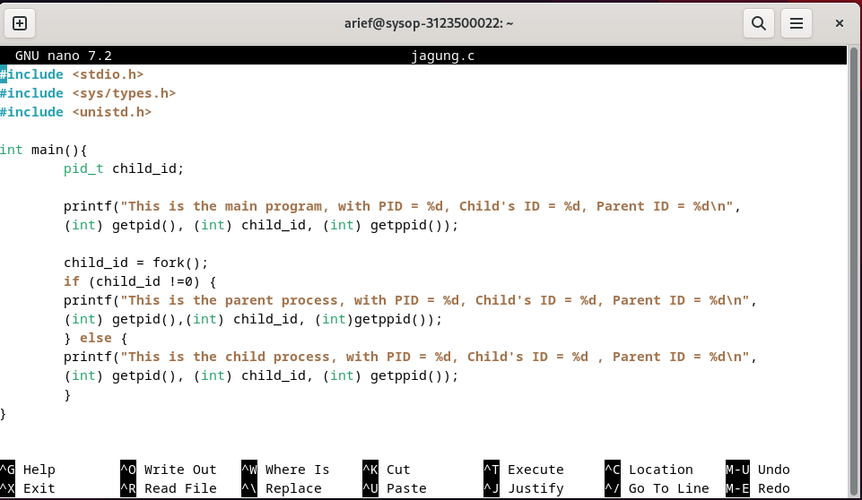

## Output :
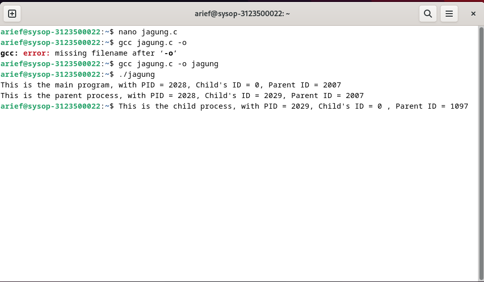

## Peta logika

### -Akses dan clonning repo : https://github.com/ferryastika/operatingsystem.git

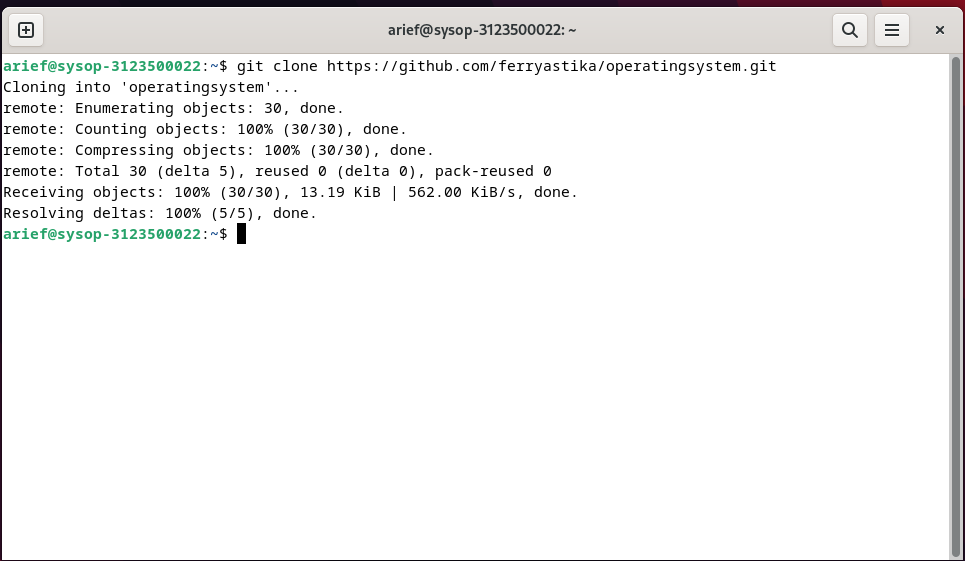

### -Deskripsikan dan visualisasikan pohon proses hasil eksekusi dari kode program fork01.c, fork02.c, fork03.c, fork04.c, fork05.cdan fork06.c.

## Fork01.c

### Output

### Deskripsi
Deskripsi Program:

1. Deklarasi variabel mypid bertipe pid_t dan myuid bertipe uid_t untuk menyimpan PID dan UID proses.
   
2. Dilakukan iterasi sebanyak 3 kali menggunakan loop for.
Pada setiap iterasi:
a. Variabel mypid diisi dengan nilai PID dari proses saat ini menggunakan fungsi getpid(). 
b. Informasi tentang proses dicetak ke layar menggunakan cout, termasuk PID, PPID (dengan menggunakan fungsi getppid()), dan UID (dengan menggunakan fungsi getuid()). 
c. Program dijeda selama 3 detik menggunakan fungsi sleep(3).

### Pohon Proses 1
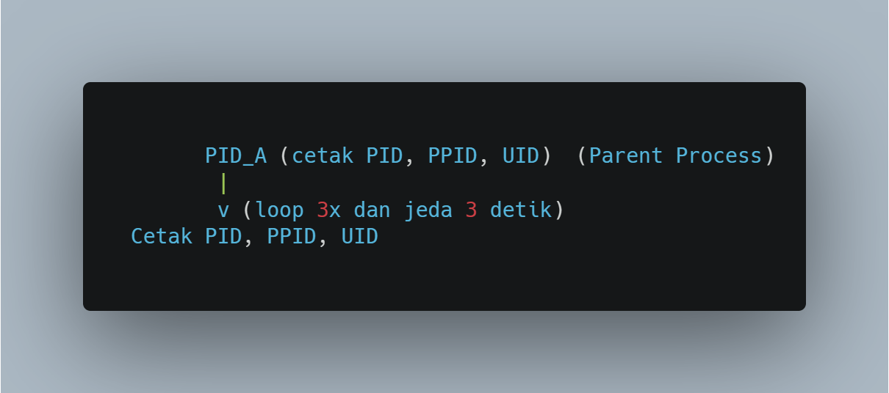

## Fork02.c
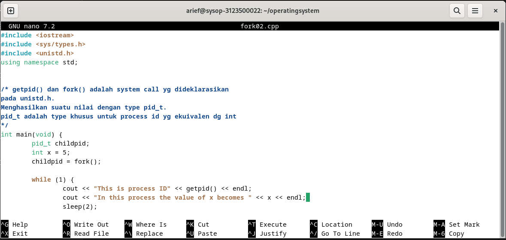

### Output
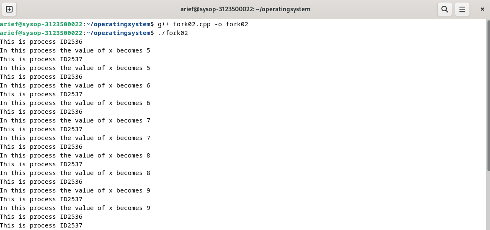

### Deskripsi
Deskripsi Program:

1. Deklarasi variabel childpid bertipe pid_t untuk menyimpan PID dari proses anak. 
2. Variabel x diinisialisasi dengan nilai 5. 
3. Dilakukan pemanggilan fork() untuk membuat proses anak. 
4. Selama program berjalan, dilakukan loop tak terbatas (while (1)) untuk mencetak informasi tentang PID dari proses saat ini (dengan menggunakan getpid()) dan nilai variabel x yang terus bertambah setiap dua detik. 
5. Program akan berjalan tanpa henti hingga dihentikan secara manual.

### Pohon Proses 2

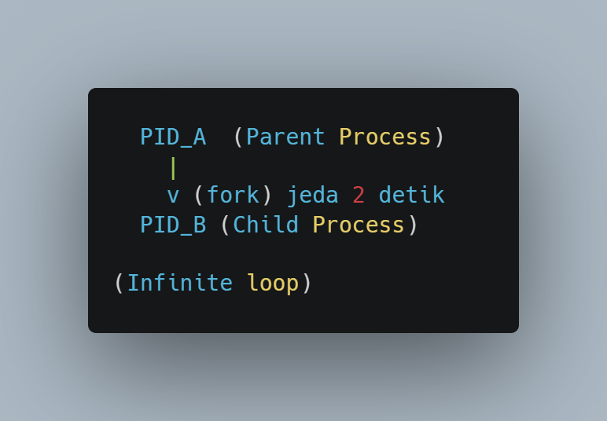

## Fork03.c

### Output
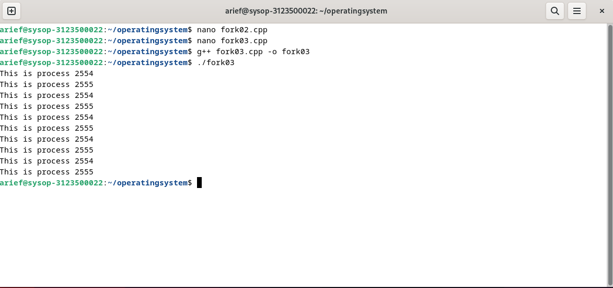

### Deskripsi
Deskripsi Program:

1. Deklarasi variabel childpid bertipe pid_t untuk menyimpan PID dari proses anak. 
2. Pemanggilan fork() untuk membuat proses anak. 
3. Dilakukan loop for sebanyak lima kali iterasi. 
4. Pada setiap iterasi, program mencetak informasi tentang PID dari proses saat itu menggunakan getpid(), dan kemudian program dijeda selama 2 detik menggunakan fungsi sleep(2). 
5. Setelah lima iterasi selesai, program akan berakhir.

### Pohon Proses 3

## Fork04.c
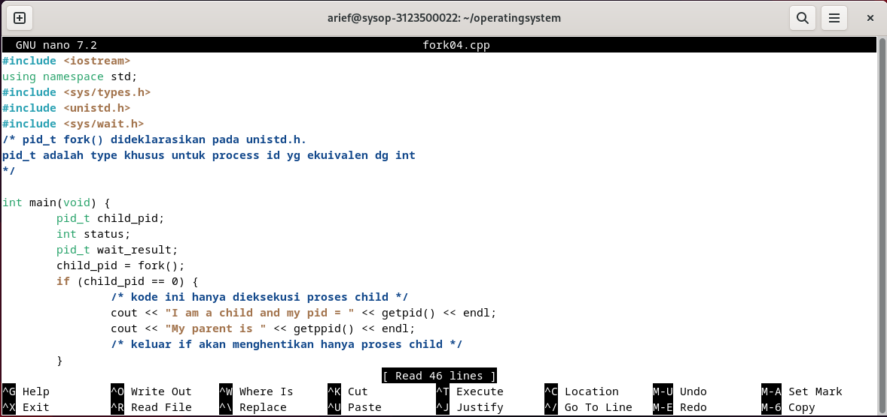

### Output

### Deskripsi
Deskripsi Program:

1. Deklarasi variabel child_pid bertipe pid_t untuk menyimpan PID dari proses anak, variabel status untuk menyimpan status keluaran dari proses anak, dan variabel wait_result bertipe pid_t untuk menyimpan hasil dari fungsi wait(). 
2. Pemanggilan fork() untuk membuat proses anak. 
Jika nilai child_pid adalah 0, maka kode dalam blok if dijalankan oleh proses anak. 
a. Proses anak mencetak informasi tentang PID dan PPID-nya. 
3. Jika nilai child_pid lebih besar dari 0, maka kode dalam blok else if dijalankan oleh proses induk. 
a. Proses induk mencetak informasi tentang PID-nya dan PID proses anak. 
4. Jika nilai child_pid kurang dari 0, maka pesan kesalahan akan dicetak dan program keluar menggunakan exit(1). 
5. Setelah itu, kedua proses (induk dan anak) akan mencetak pesan yang menunjukkan bahwa mereka sedang berjalan.

### Pohon Proses 4

## Fork05.c
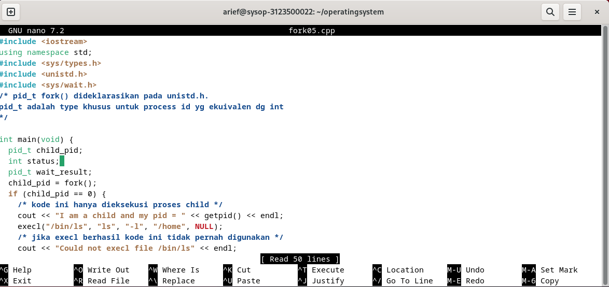

### Output
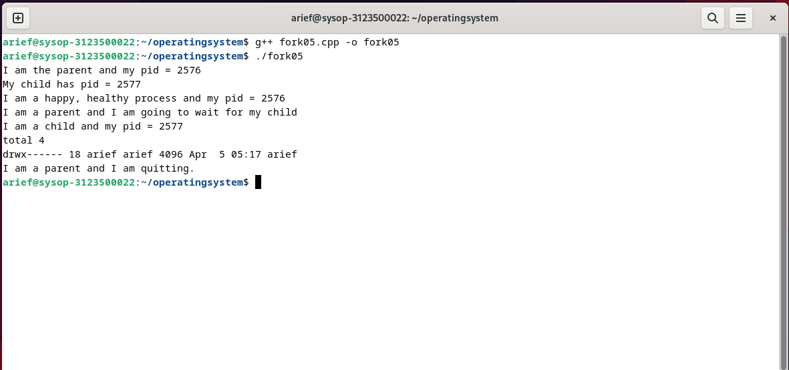

### Deskripsi
Deskripsi Program:

1. Deklarasi variabel child_pid bertipe pid_t untuk menyimpan PID dari proses anak, variabel status untuk menyimpan status keluaran dari proses anak, dan variabel wait_result bertipe pid_t untuk menyimpan hasil dari fungsi wait(). 
2. Pemanggilan fork() untuk membuat proses anak. 
3. Jika nilai child_pid adalah 0, maka kode dalam blok if dijalankan oleh proses anak. 
a. Proses anak mencetak informasi tentang PID-nya. 
b. Proses anak menjalankan perintah ls -l /home menggunakan fungsi execl(). Jika execl() berhasil, maka kode setelahnya tidak akan dieksekusi karena proses anak telah digantikan dengan proses ls -l /home. 
c. Jika execl() gagal, maka pesan kesalahan akan dicetak dan proses anak akan keluar menggunakan exit(1). 
4. Jika nilai child_pid lebih besar dari 0, maka kode dalam blok else if dijalankan oleh proses induk. 
a. Proses induk mencetak informasi tentang PID-nya dan PID proses anak. 
5. Jika nilai child_pid kurang dari 0, maka pesan kesalahan akan dicetak dan program keluar menggunakan exit(1). 

### Pohon Proses 5

## Fork06.c
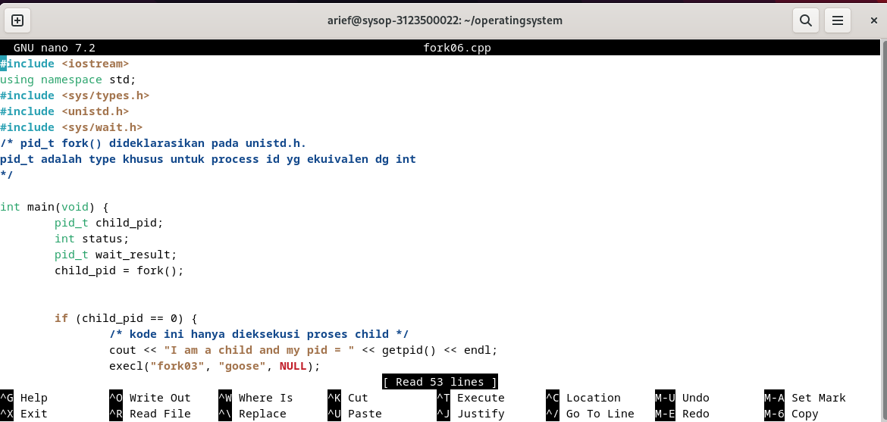

### Output
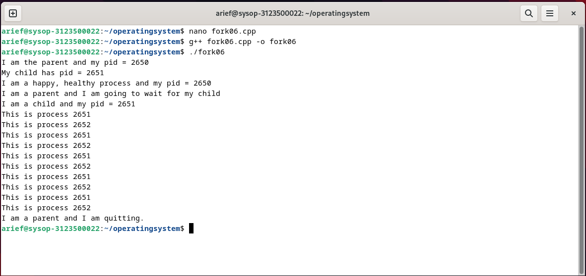

### Deskripsi
Deskripsi Program:

1. Deklarasi variabel child_pid bertipe pid_t untuk menyimpan PID dari proses anak, variabel status untuk menyimpan status keluaran dari proses anak, dan variabel wait_result bertipe pid_t untuk menyimpan hasil dari fungsi wait(). 
2. Pemanggilan fork() untuk membuat proses anak. 
3. Jika nilai child_pid adalah 0, maka kode dalam blok if dijalankan oleh proses anak. 
a. Proses anak mencetak informasi tentang PID-nya. 
b. Proses anak menjalankan program lain (dalam contoh ini "fork03" dengan argumen "goose") menggunakan fungsi execl(). Jika execl() berhasil, maka kode setelahnya tidak akan dieksekusi karena proses anak telah digantikan dengan program "fork03". 
c. Jika execl() gagal, maka pesan kesalahan akan dicetak dan proses anak akan keluar menggunakan exit(1). 
4. Jika nilai child_pid lebih besar dari 0, maka kode dalam blok else if dijalankan oleh proses induk. 
a. Proses induk mencetak informasi tentang PID-nya dan PID proses anak. 
5. Jika nilai child_pid kurang dari 0, maka pesan kesalahan akan dicetak dan program keluar menggunakan exit(1). 
6. Setelah itu, kedua proses (induk dan anak) akan mencetak pesan yang menunjukkan bahwa mereka sedang berjalan. 

### Pohon Proses 6
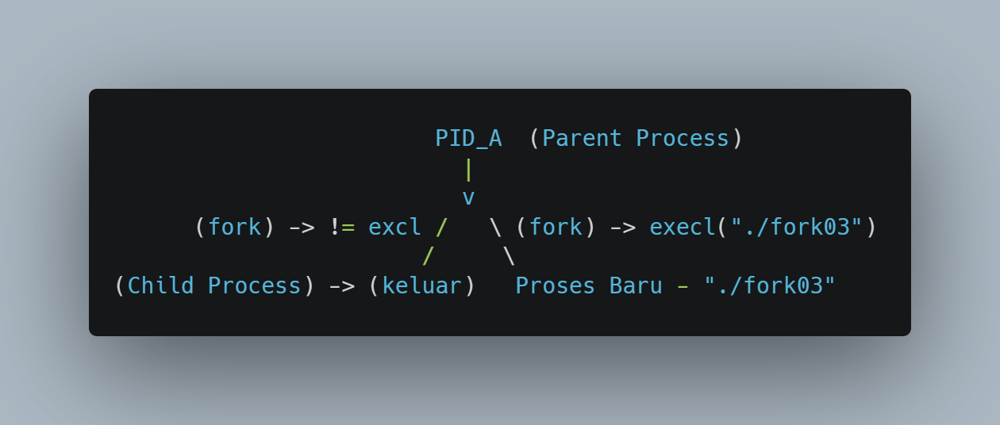

# Tugas
### Buatlah program perkalian 2 matriks [4 x 4] dalam bahasa C yang memanfaatkan fork().

## Code

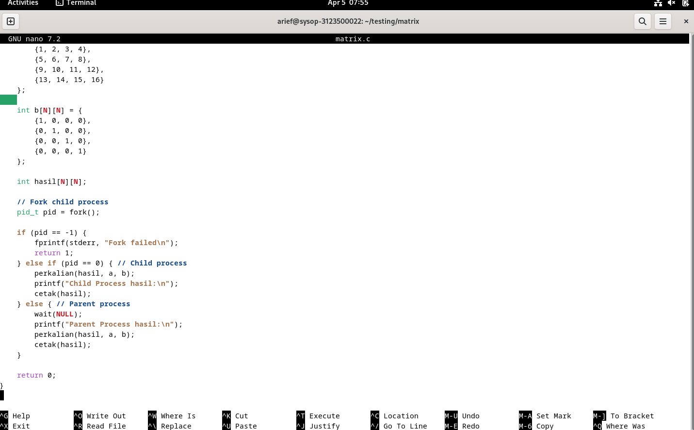

## Output

### Analisa Kode

1. Fungsi Perkalian Matriks: Fungsi perkalian() digunakan untuk melakukan perkalian matriks. Matriks hasil dideklarasikan dalam fungsi utama, kemudian diisi oleh fungsi perkalian().  

2. Fungsi Cetak Matriks: Fungsi cetak() digunakan untuk mencetak matriks ke layar.  

3. Fungsi main(): 

a. Menginisialisasi dua matriks a dan b dengan nilai sampel (matriks identitas untuk b). 

b. Membuat matriks kosong hasil untuk menyimpan hasil perkalian. 

C. Proses Fork (pid = fork()): Membuat Child Process. 

-. Jika fork gagal, pesan kesalahan dicetak dan program keluar. 

d. Child Process (pid == 0): 

-. Memanggil fungsi perkalian untuk menghitung perkalian matriks dan menyimpan hasilnya di hasil. 

-. Mencetak "Hasil Child Process:" dan kemudian memanggil fungsi cetak untuk mencetak hasil hasil. 

e. Parent Process (pid > 0): 

-. Menunggu Child Process selesai menggunakan wait(NULL). 

-. Mencetak "Hasil Parent Process:" dan kemudian memanggil fungsi perkalian. 

-. Memanggil fungsi cetak untuk mencetak hasil hasil (hasil yang sama dicetak oleh Child Process). 

### Visualisasi Proses Fork
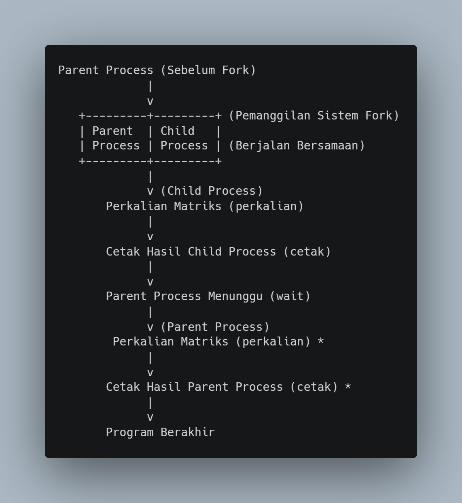